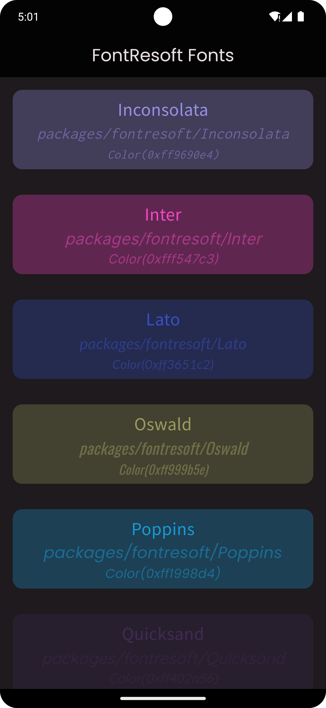
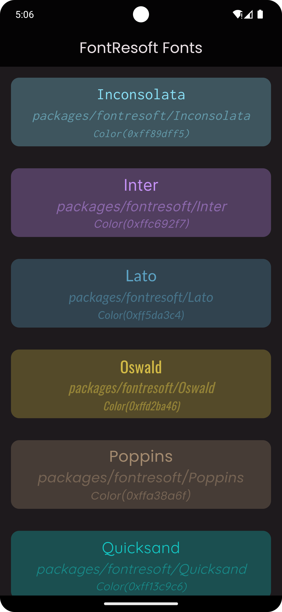
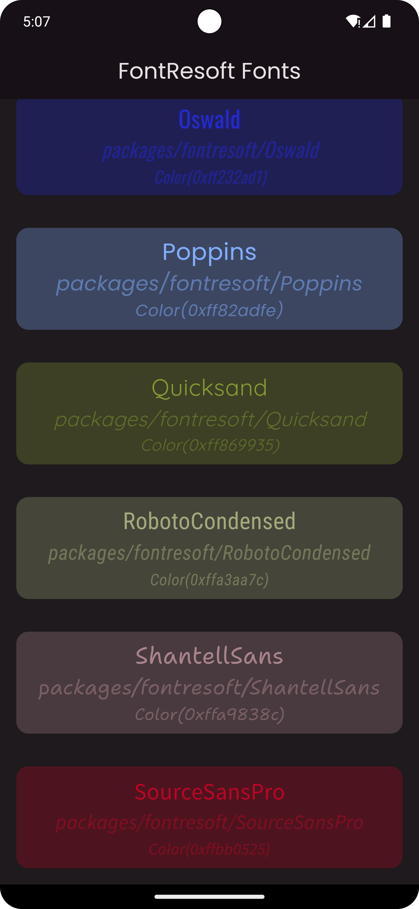

FontResoft is a flutter font package compiled and arranged by us for use in any flutter project.
It contains different beautiful fonts for building nice, eye-catchy flutter apps.

## Features

Currently 9 font families are defined in this library

1. inconsolata
2. inter
3. lato
4. oswald
5. poppins
6. quicksand
7. robotoCondensed
8. shantellSans
9. sourceSans

## Getting started

To use as a library, add the dependency in your pubspec.yaml file, thus:

```yaml
fontresoft:
    git:
      url: git@github.com:kenresoft/fontresoft.git
      ref: release
```

## Usage

An example of how to use this in the main.dart file:

```dart
ThemeData(
    useMaterial3: true,
    brightness: Brightness.light,
    colorSchemeSeed: Colors.purpleAccent,
    fontFamily: FontResoft.poppins,
    package: FontResoft.package,
    highlightColor: Colors.transparent,
    splashColor: Colors.transparent,
);
```

An example of how to use in your dart code.

```dart
Text(
  'Sample Text',
  style: Font.sourceSans().copyWith(
    fontSize: 23,
    color: color.withOpacity(1),
  ),
);
```

```dart
Text(
  Font.sourceSans().getFontName,
  style: Font.sourceSans(
    style: TextStyle(
      fontSize: 23,
      color: color.withOpacity(1),
    ),
  ),
)
```

## Screenshots

<div>
  
  <p>Screenshot 1</p>
</div>

<div>
  
  <p>Screenshot 2</p>
</div>

<div>
  
  <p>Screenshot 3</p>
</div>

<!--div>

  <p>Screen Record</p>
</div-->

## Additional information

In the future, we plan to provide support for additional fonts, making it even simpler for other developers to swiftly adopt our work. 
If you think we should add other typefaces, please let us know. 
We created this package to alleviate some of the burden that developers have when it comes to organizing the fonts by weights and styles.
